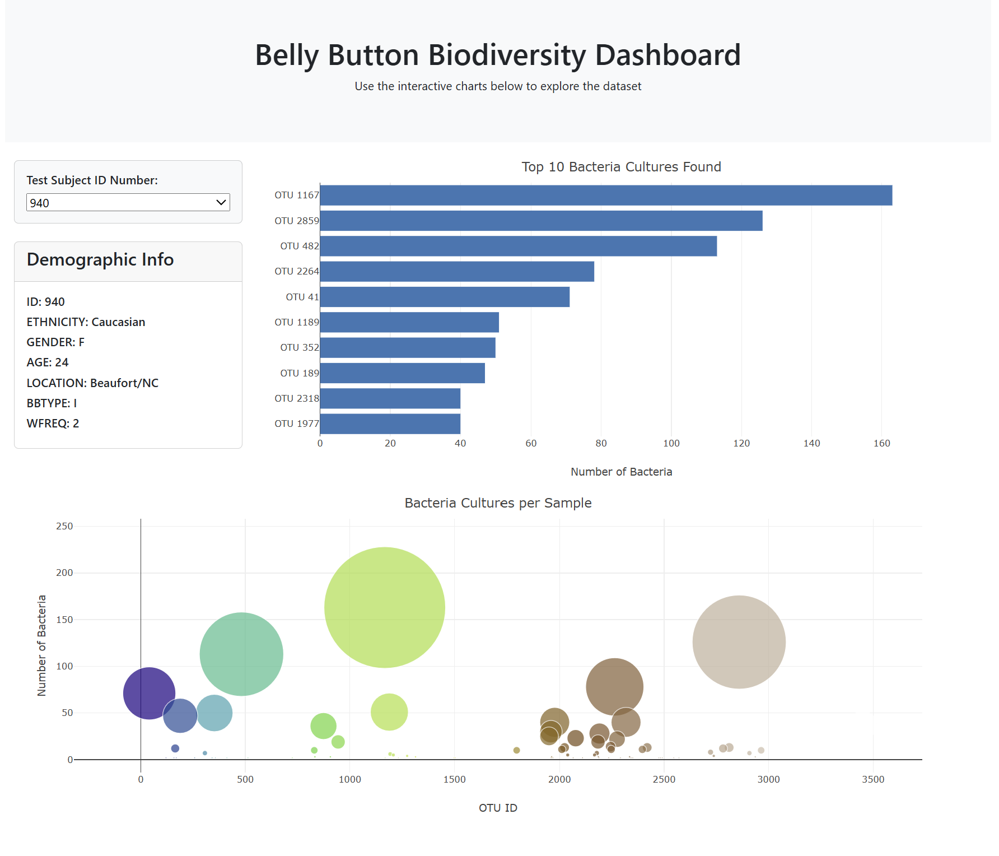

# belly-button-challenge
Building an interactive dashboard to explore the Belly Button Biodiversity dataset. 

The dataset reveals that a small handful of microbial species (also called operational taxonomic units, or OTUs, in the study) were present in more than 70% of people, while the rest were relatively rare.

The following steps were followed to build the interactive dashboard to explore the Belly Button Biodiversity dataset:

1. Using the D3 library, I read the samples.json file from the URL https://static.bc-edx.com/data/dl-1-2/m14/lms/starter/samples.json.

2. I then created a horizontal bar chart with a dropdown menu to display the top 10 OTUs found in that individual. For this: 
* sample_values were used as the values for the bar chart.
* otu_ids were used as the labels for the bar chart.
* otu_labels were used as the hovertext for the chart.
3. I created a bubble chart that displays each sample with the following attributes: 
* otu_ids for the x values.
* sample_values for the y values.
* sample_values for the marker size.
* otu_ids for the marker colors.
* otu_labels for the text values.

4. I also displayed the sample's metadata, i.e., an individual's demographic information. To achieve this, I looped through each key-value pair from the metadata JSON object and created a text string. I then appended an html tag with that text to the #sample-metadata panel.

5. I made sure that all the plots update when a new sample is selected. 

The dashboard looks as follows: 

*References*
*Hulcr, J. et al. (2012) A Jungle in There: Bacteria in Belly Buttons are Highly Diverse, but Predictable. Retrieved from: http://robdunnlab.com/projects/belly-button-biodiversity/results-and-data/Links to an external site.*
